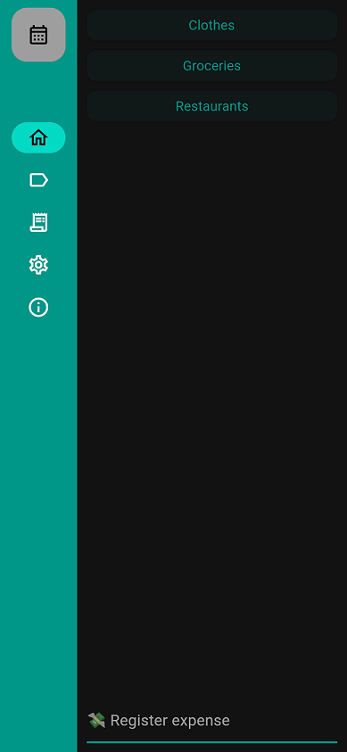

# Spending tracker

An app to easily manage my spendings. Version 2, made with Flutter.

The project was created for me to use, but also to check out Flutter and Dart.

Flutter enabled the creation of a [web version of the app](https://spendingtracker.cortez.top) that is automatically a PWA, and can be added to the home-screen of mobile devices, avoiding the need to download the app via an app store (although some browsers have a time-based local storage cleanup schedule).

## features

- Register expenses for a category of expense in one click
- Manage existing expenses and categories
- see a report of expenses grouped by category

This is beta software and might have incomplete functionality.
